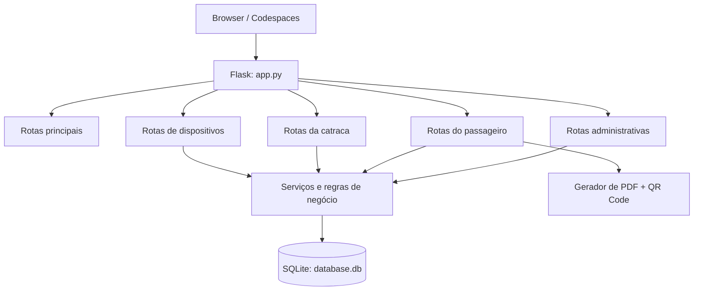

# Catraca Virtual

Sistema web de demonstração acadêmica para gestão de cartões de transporte, recargas, validação em catraca, planejamento de rotas e administração de dispositivos.

> Os dados cadastrados devem ser fictícios. O projeto não substitui um sistema de bilhetagem real.

## Visão geral

O sistema atende três perfis:

- **Administrador**: cria, bloqueia e exclui cartões; administra estações, dispositivos e configurações.
- **Passageiro**: consulta o cartão, recarrega créditos, planeja viagens e baixa um cartão em PDF quando permitido.
- **Catraca**: valida código público/QR Code ou token privado, verifica saldo e registra a passagem.

Principais recursos:

- Cadastro padronizado de passageiro, CPF, celular brasileiro e saldo inicial.
- Saldo, recarga e tarifa com valores monetários no padrão brasileiro.
- QR Code com código público do cartão.
- PDF sem saldo, token privado, CPF, celular ou histórico.
- Configurações administrativas aplicadas às regras do sistema.
- Histórico temporário de passagens e recargas.
- Endereço de login por dispositivo que usa automaticamente a URL em que o projeto está aberto.

## Arquitetura



O arquivo `app.py` inicializa o Flask, o banco, os filtros de template e o carregamento dos módulos. Cada área do sistema possui seu próprio módulo de rotas.

## Estrutura do projeto

```text
Catraca/
├── app.py                 # Inicialização da aplicação Flask
├── requirements.txt       # Dependências Python
├── database.db            # Banco SQLite local
├── routes/
│   ├── main.py            # Login, redirecionamentos e health check
│   ├── admin.py           # Administração de cartões, estações e configurações
│   ├── usuario.py         # Área do passageiro
│   ├── catraca.py         # Validação de entrada
│   └── dispositivos.py    # Links e vínculo de dispositivos
├── utils/
│   ├── auth.py            # Autorização por token
│   ├── config.py          # Configurações dinâmicas
│   ├── database.py        # Conexão SQLite por requisição
│   ├── helpers.py         # Normalização e formatação
│   ├── migrate.py         # Criação/migração do banco
│   ├── queries.py         # Consultas e registros
│   ├── validation.py      # Regras da catraca
│   └── pdf.py             # Cartão PDF e QR Code
├── templates/             # Telas Jinja
├── static/                # CSS, JavaScript e leitor QR
└── docs/
    └── DER.md             # Diagrama entidade-relacionamento
```

## Requisitos

- Python 3.10 ou superior
- SQLite3 (já incluso no Python)
- Dependências de `requirements.txt`

## Execução local

```bash
python -m venv venv
source venv/bin/activate
pip install -r requirements.txt
python app.py
```

A aplicação inicia em `http://localhost:5000`.

Para verificar se está disponível:

```bash
curl http://localhost:5000/health
```

Resposta esperada:

```json
{"status":"ok"}
```

## Variáveis de ambiente

| Variável | Finalidade | Padrão de demonstração |
|---|---|---|
| `PORT` | Porta HTTP | `5000` |
| `FLASK_DEBUG` | Ativa debug quando igual a `1` | `0` |
| `SECRET_KEY` | Chave de sessão Flask | `catraca-demo-secret` |
| `ADMIN_TOKEN` | Credencial do administrador padrão | `admin-demo-2026` |
| `CATRACA_TOKEN` | Credencial da catraca padrão | `catraca-demo-2026` |
| `USUARIO_TOKEN` | Credencial de dispositivo de usuário padrão | `usuario-demo-2026` |

> Troque as credenciais padrão antes de disponibilizar o projeto fora de uma demonstração controlada.

## Execução no GitHub Codespaces

No terminal do Codespaces:

```bash
source venv/bin/activate
python app.py
```

Abra a porta `5000` na aba **Ports** e defina a visibilidade necessária. O Codespaces fornecerá uma URL pública semelhante a:

```text
https://<nome-do-codespace>-5000.app.github.dev
```

Não existe `localhost` fixo no código. Navegação e o endereço de login usam a origem da requisição atual; portanto, cada Codespace gera links com a sua própria URL pública.

## Acesso inicial

1. Abra `/login`.
2. Entre com uma das credenciais de demonstração:

| Perfil | Usuário | Senha |
|---|---|---|
| Administração | `admin` | valor de `ADMIN_TOKEN` |
| Catraca | `catraca` | valor de `CATRACA_TOKEN` |
| Passageiro | código público ou nome vinculado | token privado do cartão |

Os dispositivos criados pelo administrador recebem tokens próprios e links diretos.

## Fluxos principais

### Administração

O administrador pode:

- Criar cartões e respectivos acessos de passageiro.
- Consultar, bloquear/ativar e excluir cartões.
- Excluir cartões com seus dados vinculados: dispositivos, recargas, passagens, rotas e trechos. A operação é permanente.
- Cadastrar, ativar e desativar estações.
- Criar e vincular dispositivos dos tipos `admin`, `catraca` e `usuario`; a tela mostra o usuário e a senha que devem ser usados no login.
- Alterar regras de tarifa, recarga, retenção de histórico e download do PDF.

### Cadastro de cartão

Regras aplicadas no navegador e no servidor:

- Nome normalizado para letras maiúsculas.
- CPF com 11 dígitos e máscara `000.000.000-00`.
- Celular com DDI Brasil e DDD Londrina: `+55 (43) 99999-9999`.
- Saldo inicial limitado pelos valores mínimo e máximo de recarga definidos na administração.
- Valores em formato brasileiro, como `20,00`, são armazenados como `20.00` no SQLite e exibidos como `R$ 20,00`.

### Passageiro

O passageiro autenticado pode consultar o cartão, efetuar recargas, ver o histórico de recargas, planejar uma rota e acompanhar/cancelar a rota planejada.

O PDF contém nome, código público, status, data de emissão, QR Code e aviso de simulação acadêmica. Ele não exibe saldo ou informações privadas.

### Catraca

A catraca aceita o QR Code/código público ou o token privado. Na validação, o sistema:

1. Localiza o cartão.
2. Confere o status do cartão.
3. Confere o saldo contra a tarifa atual.
4. Confere a rota planejada, quando houver.
5. Desconta a tarifa e registra a passagem aprovada, ou registra o motivo da negação.

## Configurações administrativas

| Configuração | Regra aplicada |
|---|---|
| Valor da passagem | Débito da catraca e estimativa de rota |
| Histórico de passagens em horas | Prazo de retenção dos registros de passagem |
| Valor mínimo de recarga | Recarga e saldo inicial mínimo |
| Valor máximo de recarga | Recarga e saldo inicial máximo |
| Histórico de recargas em dias | Prazo de retenção dos registros de recarga |
| Permitir download do cartão em PDF | Exibe o botão e libera/bloqueia a rota de PDF no servidor |

As configurações são persistidas na tabela `configuracoes` e lidas durante cada fluxo relevante.

## Rotas principais

| Método | Rota | Descrição |
|---|---|---|
| `GET` | `/health` | Verificação de disponibilidade |
| `GET` / `POST` | `/login` | Autenticação inicial |
| `GET` | `/admin` | Painel administrativo |
| `GET` / `POST` | `/criar-cartao` | Criação de cartão |
| `GET` | `/admin/cartoes` | Gestão de cartões |
| `POST` | `/admin/cartoes/<id>/status` | Altera o status de um cartão |
| `POST` | `/admin/cartoes/<id>/excluir` | Exclui cartão e dados vinculados |
| `GET` / `POST` | `/admin/estacoes` | Gestão de estações |
| `GET` / `POST` | `/admin/configuracoes` | Configurações do sistema |
| `GET` / `POST` | `/dispositivos` | Gestão de dispositivos |
| `GET` | `/usuario/meu-cartao` | Cartão do passageiro |
| `GET` / `POST` | `/usuario/recarregar-cartao` | Recarga |
| `GET` | `/usuario/recargas` | Histórico de recargas do passageiro |
| `GET` | `/usuario/cartao/pdf` | Download do cartão PDF |
| `GET` / `POST` | `/usuario/planejar-viagem` | Planejamento de rota |
| `GET` | `/usuario/minha-viagem` | Rota planejada |
| `GET` | `/catraca` | Interface da catraca |
| `POST` | `/catraca/validar` | Validação de entrada |

Todas as rotas protegidas exigem uma sessão criada pelo login. Tokens em parâmetros de URL não concedem acesso.

## Banco de dados e DER

O banco de dados é SQLite e é criado/migrado automaticamente na primeira inicialização. O modelo completo, com entidades, atributos, relações e política de exclusão, está em [docs/DER.md](docs/DER.md).

Entidades principais:

- `usuarios` e `cartoes`
- `dispositivos`
- `estacoes`
- `passagens` e `recargas`
- `rotas_viagem` e `trechos_viagem`
- `configuracoes`

## Testes básicos

```bash
python -m py_compile app.py routes/*.py utils/*.py
curl http://localhost:5000/health
```

Checklist recomendado para demonstração:

- Criar cartão com CPF e celular formatados.
- Verificar o limite de saldo inicial.
- Alterar tarifa e validar uma passagem.
- Fazer uma recarga dentro e fora dos limites.
- Gerar PDF com download permitido e bloqueá-lo pela administração.
- Criar, vincular e abrir um dispositivo.
- Excluir um cartão de teste e confirmar a limpeza de seus dados vinculados.

## Licença e uso

Projeto destinado a fins acadêmicos e demonstrativos. Não utilize dados pessoais reais ou credenciais padrão em ambiente público.
