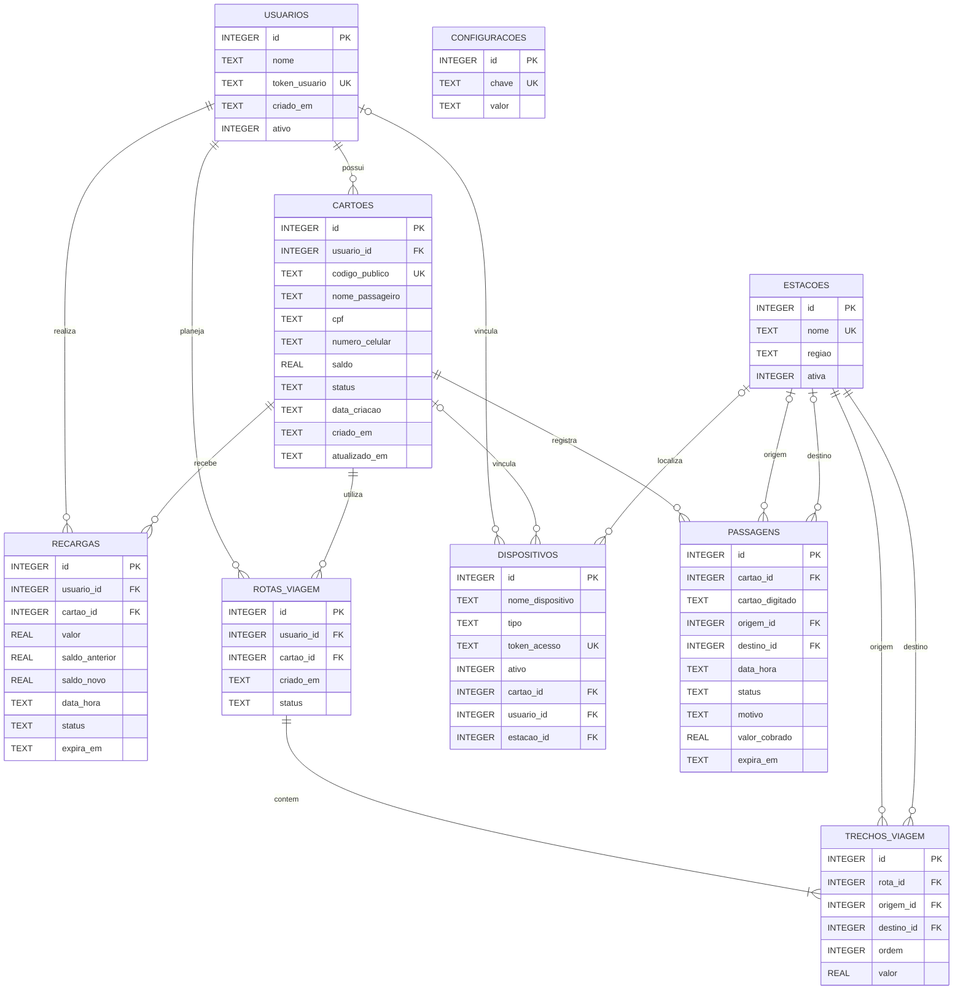

# DER — Catraca Virtual

Este documento apresenta o Diagrama Entidade-Relacionamento (DER) do banco SQLite utilizado pelo sistema. O diagrama pode ser renderizado diretamente no GitHub.

## Diagrama entidade-relacionamento

## Entidades

| Entidade | Finalidade | Chave principal |
|---|---|---|
| `usuarios` | Passageiros com token privado de acesso | `id` |
| `cartoes` | Cartões públicos, saldo e status | `id` |
| `estacoes` | Pontos de embarque, terminais e regiões | `id` |
| `passagens` | Tentativas de entrada aprovadas ou negadas | `id` |
| `recargas` | Créditos adicionados ao cartão | `id` |
| `rotas_viagem` | Roteiros planejados por passageiro | `id` |
| `trechos_viagem` | Etapas que formam uma rota planejada | `id` |
| `dispositivos` | Acessos de administrador, catraca ou passageiro | `id` |
| `configuracoes` | Parâmetros dinâmicos de regra de negócio | `id` |

## Relações e cardinalidades

| Origem | Relação | Destino | Cardinalidade |
|---|---|---|---|
| Usuário | possui | Cartão | 1 : N |
| Usuário | realiza | Recarga | 1 : N |
| Usuário | planeja | Rota de viagem | 1 : N |
| Cartão | registra | Passagem | 1 : N |
| Cartão | recebe | Recarga | 1 : N |
| Cartão | utiliza | Rota de viagem | 1 : N |
| Rota de viagem | contém | Trecho de viagem | 1 : N |
| Estação | participa como origem/destino | Passagem e trecho | 1 : N |
| Dispositivo | pode estar vinculado a | Usuário, cartão e/ou estação | 0 : 1 em cada vínculo |

`configuracoes` é uma entidade independente: cada linha armazena uma chave única e seu valor atual.

## Regras de integridade relevantes

- `usuarios.token_usuario`, `cartoes.codigo_publico`, `estacoes.nome`, `dispositivos.token_acesso` e `configuracoes.chave` são únicos.
- `cartoes.status` aceita `ativo` ou `bloqueado`.
- `passagens.status` aceita `aprovado` ou `negado`.
- `rotas_viagem.status` aceita `planejada`, `cancelada` ou `concluida`.
- `dispositivos.tipo` aceita `admin`, `catraca` ou `usuario`.
- O saldo do cartão não pode ser negativo.
- Passagens e recargas possuem `expira_em`, utilizado pela limpeza automática de histórico.

## Exclusão de cartão

A exclusão administrativa é transacional. Ao excluir um cartão, o sistema remove seus trechos, rotas, passagens, recargas e dispositivos vinculados. Se o usuário não possuir outro cartão, seu acesso e os dispositivos associados a ele também são removidos.

## Índices utilizados

| Índice | Objetivo |
|---|---|
| `idx_cartoes_codigo_publico` | Busca rápida do cartão por QR Code/código público |
| `idx_passagens_expira_em` | Limpeza do histórico de passagens |
| `idx_recargas_expira_em` | Limpeza do histórico de recargas |
